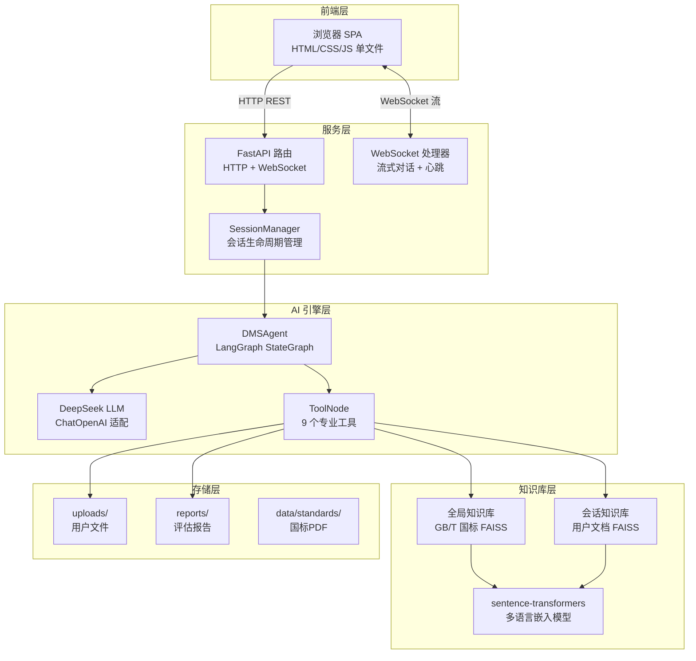
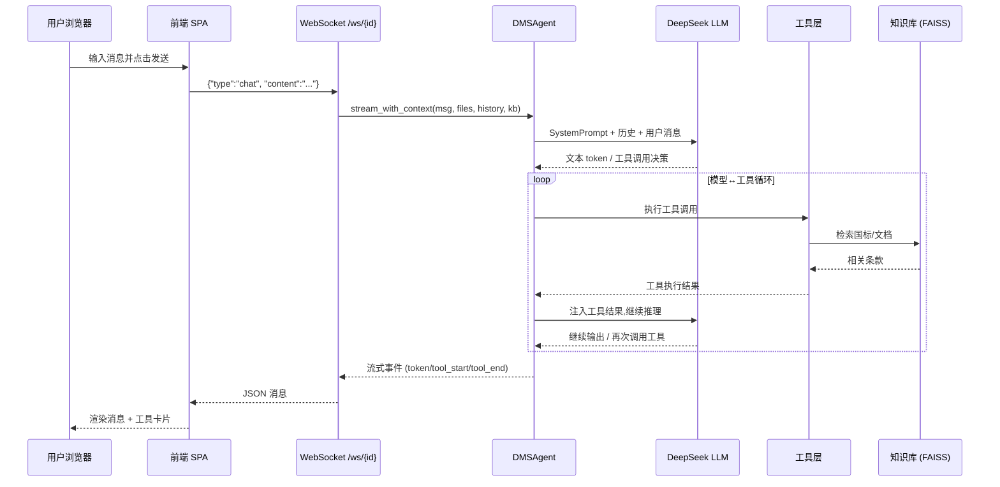
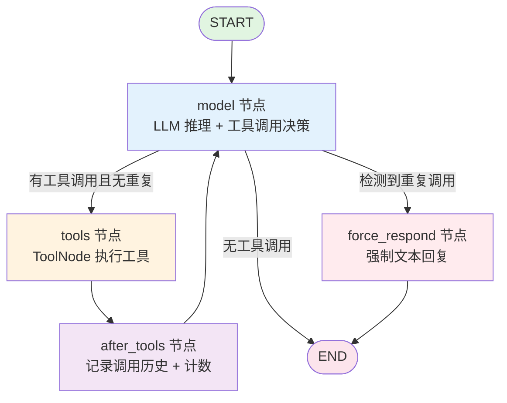

# DMS Agent — 项目架构与实现详解

## 一、项目概述

DMS Agent 是一个面向 **DMS（驾驶员监测系统）** 领域的 AI 数字工程师，基于 LangGraph 状态图驱动多轮工具调用循环，结合 RAG 向量知识库（GB/T 国标 + 用户自定义文档），帮助工程师评估系统性能、发现合规差距、给出可落地的优化方案。

### 技术栈一览

| 层级 | 技术 | 用途 |
|------|------|------|
| 编排框架 | **LangGraph** (StateGraph) | Agent 工具调用循环 |
| 大模型 | **DeepSeek** (deepseek-v4-pro / DeepSeek-R1) | 推理 + 工具调用 |
| 模型适配 | **LangChain** (ChatOpenAI) | 统一 LLM 调用接口 |
| 嵌入模型 | **sentence-transformers** (paraphrase-multilingual-MiniLM-L12-v2) | 文档向量化 |
| 向量库 | **FAISS** (faiss-cpu) | 向量相似度检索 |
| 后端 | **FastAPI** + **uvicorn** + **WebSocket** | HTTP 服务 + 实时流 |
| 前端 | 原生 HTML/CSS/JS (单文件 SPA) | 全功能交互界面 |
| 数据处理 | **pandas** | 性能日志解析 |
| 代码分析 | Python **AST** 模块 | 源码结构分析 |
| 网页搜索 | **ddgs** (DuckDuckGo) | 技术资料参考 |

### 项目文件结构

```
DMS_Agent_Project/
├── server.py                # FastAPI 服务端：HTTP+WS+会话管理
├── requirements.txt         # Python 依赖
├── .env                     # 环境变量配置
├── .gitignore
├── static/
│   └── index.html           # 前端单文件 SPA
├── src/
│   ├── agent_core.py        # DMSAgent: LangGraph 状态图 + System Prompt
│   ├── tools.py             # 9 个 LangChain Tool
│   ├── config.py            # 配置加载器
│   ├── code_analyzer.py     # AST 代码分析 + 文件扫描
│   ├── rag_engine.py        # 全局知识库（GB/T 国标 PDF）
│   ├── session_kb.py        # 会话级知识库（用户上传文档）
│   ├── models.py            # 数据模型（LogItem 等）
│   └── parsers.py           # 日志解析（CSV → LogItem）
├── data/
│   ├── standards/           # 国标 PDF + FAISS 索引
│   │   ├── 疲劳驾驶检测国标.pdf
│   │   └── faiss_index/
│   └── source_code/         # 示例 DMS 源码（人脸检测、特征提取等）
├── reports/                 # Agent 生成的评估报告
└── uploads/                 # 用户上传文件（按会话ID分目录）
```

---

## 二、系统架构全景图

### 2.1 技术架构层次



### 2.2 数据流序列图



### 2.3 LangGraph 状态图详解



**节点说明**：

| 节点 | 功能 | 触发条件 |
|------|------|---------|
| `model` | 调用 LLM，决定是否调用工具。同时执行 XML 幻觉检测与修复 | 每次对话的入口 |
| `tools` | LangGraph 内置 ToolNode，执行实际工具函数 | model 产生 tool_calls |
| `after_tools` | 更新 `tool_call_count`、`tool_call_history`、`round_count` | tools 执行完毕 |
| `force_respond` | 剥离未执行的 AIMessage，使用 `tool_choice="none"` 强制 LLM 停止调工具并给出文本回复 | 检测到同一工具+同一参数重复调用 |

**防重复调用机制**：

Agent 维护 `tool_call_history` 列表，每项记录 `{tool, target}`（target = 工具参数的字符串表示）。当 `should_continue` 检测到新工具调用与历史记录重复时，路由至 `force_respond`。四个探索类工具豁免：`read_code_file`、`scan_codebase`、`search_web`、`search_standards`（允许用不同查询词重复搜索）。

---

## 三、System Prompt 设计 (agent_core.py:50-132)

System Prompt 是整个 Agent 行为的核心控制器，分为五个模块：

### 3.1 核心原则

| 原则 | 说明 |
|------|------|
| **专业精度第一** | DMS 专业评估工具，不是通用聊天助手。有数据支撑的判断必须引用具体数值 |
| **用工具获取事实** | 涉及用户代码、数据、系统的分析必须通过工具获取，不猜测。纯知识性问答且确定答案时可跳过工具 |
| **聚焦用户问题** | 用户问 FPS 就深入 FPS，不自动扩展到其他维度。但发现严重影响因素时指出并询问 |

### 3.2 工具使用规则

- **不重复调用**：同一工具不对同一目标重复调用
- **错误不重试**：工具返回 `[ERR]` 或 `[FAIL]` 时直接告知用户
- **用已有信息**：已有信息能支撑结论时直接回答
- **无文件时提醒**：用户没上传文件时提醒上传

### 3.3 修改代码规则（严格遵守）

这是最严格的部分：
- 每次只描述并执行 **1 处**修改
- 流程：描述修改 → 调用 modify_code → 确认成功/失败 → 下一处
- 各修改之间用 `---` 分隔
- `[ERR]` 代表片段未找到 → 用 read_code_file 重新确认当前内容
- **关联修改必须成对完成**：修改 A（如改函数签名）+ 修改 B（如改调用方）必须同一轮对话全部完成
- 修改前必须解释原因、关联指标、评估风险
- 绝对禁止删除安全逻辑或降低告警灵敏度

### 3.4 DMS 领域知识

Prompt 内嵌了：
- **标准架构**：Camera → Face Detection → Feature Extraction → State Determination → Alert
- **核心指标体系**：FPS / 端到端延迟 / 疲劳检测 / 分心检测 / 违规检测 / 资源
- **5 条 GB/T 国标关键要求**：告警延迟 ≤ 行为持续时间 50%、至少 2 种提示方式、上电自检、故障降级策略、打哈欠检测时间窗约 3s

---

## 四、9 个工具详解

### 4.1 探索类工具

#### `scan_codebase(source_dir: str) -> str`
- **功能**：扫描目录中所有 `.py` 文件，返回目录树和文件大小
- **实现**：`src/code_analyzer.py` 中的 `scan_directory()`，递归遍历返回树形结构
- **使用场景**：代码探索的第一步

#### `analyze_code_structure(source_dir: str) -> str`
- **功能**：AST 解析所有 Python 文件，提取类名、方法、函数、导入依赖、关键常量
- **实现**：`src/code_analyzer.py` 中的 `analyze_python_files()`，使用 Python `ast` 模块
- **使用场景**：快速定位关键模块，了解代码骨架

#### `read_code_file(file_path, start_line, end_line) -> str`
- **功能**：按指定行号范围读取 Python 文件内容
- **实现**：`src/code_analyzer.py` 中的 `read_file_content()`
- **使用场景**：精读特定函数/类的实现细节

#### `parse_performance_logs(log_path: str) -> str`
- **功能**：解析 DMS 性能日志 CSV（需含 `timestamp`, `fps`, `latency_ms` 列），计算 FPS/延迟/CPU/内存的统计指标，并给出 DMS 专业判定
- **DMS 判定标准**：

| 指标 | 优秀 | 合格 | 不合格 |
|------|------|------|--------|
| FPS | ≥30 | ≥15 | <15 |
| 延迟 | - | ≤200ms | >500ms（严重超标） |

- **实现**：使用 pandas 读取 CSV，通过 `LogParser._rows_to_models()` 转换为 `LogItem` 对象，计算各维度的 min/max/avg

#### `search_standards(query: str) -> str`
- **功能**：双轨检索 —— 同时搜索全局 GB/T 国标知识库 + 当前会话的用户文档
- **实现**：
  - 如果 `_session_kb` 已设置 → 调用 `SessionKnowledgeBase.search()`（内部合并全局 + 会话结果）
  - 否则 → 仅搜索全局 `StandardKnowledgeBase`
- **结果格式**：
  ```
  [GB/T National Standard] 疲劳检测延迟应不超过行为持续时间的50%...
  [User Document - my_notes.pdf - Clause 2] 本项目要求检测延迟低于200ms...
  ```

#### `search_web(query: str) -> str`
- **功能**：DuckDuckGo 搜索技术参考资料
- **实现**：使用 `ddgs` 库（优先）或 `duckduckgo_search` 库，返回前 5 条结果的标题+摘要+链接
- **注意**：校园网环境可能受限，工具内置了错误提示

### 4.2 行动类工具

#### `modify_code(file_path, old_snippet, new_snippet) -> str`
- **功能**：替换代码片段，写入文件，生成 unified diff
- **安全机制**：
  1. 验证 `old_snippet` 在文件中出现**恰好 1 次**（0 次 = `[ERR]`，>1 次 = 要求提供更精确上下文）
  2. 检测 `alert/warn/safety/critical/emergency` 关键词 → 标注 `[!] 高风险`
  3. 其余修改标注 `[OK] 低风险`
  4. 生成 unified diff 供审查
- **返回**：风险评估 + diff 文本 + 验证建议

#### `compare_metrics(old_log, new_log) -> str`
- **功能**：对比优化前后两份 CSV 性能日志，生成 Markdown 对比表格
- **实现**：
  1. 分别解析两个 CSV 文件
  2. 计算 fps/latency_ms/cpu_usage/memory_usage_mb 四项指标的均值
  3. 计算变化量和变化百分比
  4. 判定：基本持平(<5%) / 改善 / 显著改善(>30%) / 恶化 / 严重恶化
- **注意**：此工具不区分哪份文件是"优化前"、哪份是"优化后"——由 Agent 根据用户消息中的描述来分配参数

#### `save_report(report_content: str) -> str`
- **功能**：保存 Markdown 格式评估报告到 `reports/` 目录
- **文件命名**：`dms_report_{YYYYMMDD_HHMMSS}.md`
- **使用时机**：仅当用户要求"完整评估"、"全面审查"或点击前端"生成报告"按钮时使用

---

## 五、知识库系统 (RAG) 详解

### 5.1 嵌入模型

**模型**：`sentence-transformers/paraphrase-multilingual-MiniLM-L12-v2`
- 参数量：~118MB
- 支持 50+ 语言（中文表现良好）
- 向量维度：384
- 加载方式：HuggingFace Hub（离线模式可用 `HF_HUB_OFFLINE=1`）

### 5.2 全局知识库 (`rag_engine.py`)

```
PDF 文件
  │ PyPDFLoader (pypdf)
  ▼
Document 对象列表
  │ RecursiveCharacterTextSplitter (chunk_size=500, overlap=50)
  ▼
文本 Chunks
  │ sentence-transformers 嵌入
  ▼
FAISS 向量索引 → 持久化到 data/standards/faiss_index/
```

- **索引构建**：首次启动时扫描 `data/standards/*.pdf`，构建后缓存到磁盘
- **搜索接口**：`search_standard(query, k=3)` → 返回 Top-K 最相关国标条款
- **增量更新**：检测到新 PDF 时自动重建索引

### 5.3 会话知识库 (`session_kb.py`)

每个会话拥有独立的 FAISS 索引：

- **共享嵌入模型**：与全局 KB 共用同一个模型实例（`_get_model()` 单例），避免重复加载
- **持久化**：文档存储在 `uploads/<session>/knowledge/`，服务器重启后自动重建索引
- **支持格式**：PDF、TXT、MD、Markdown
- **合并搜索**：`search()` 方法返回格式：

```python
# 先搜全局国标 → 再搜会话文档 → 合并结果
results = {
    "chunks": [...],           # 全局国标 chunks
    "session_chunks": [...],   # 会话文档 chunks（标注来源文件名）
}
```

前端渲染时，`[GB/T National Standard]` 和 `[User Document - xxx.pdf]` 前缀让用户清晰区分来源。

---

## 六、会话与文件管理

### 6.1 SessionManager

```
POST /api/session
  │
  ├── 生成 12 位 hex session_id
  ├── 创建 uploads/<id>/ 目录
  ├── 后台线程初始化 Agent (~10-15s)
  │   ├── 导入 DMSAgent 模块（首次）
  │   ├── 加载全局 StandardKnowledgeBase + FAISS 索引
  │   ├── 创建 SessionKnowledgeBase（重建或新建会话文档索引）
  │   └── 初始化 DMSAgent(session_kb=...)
  └── 立即返回 session_id（不阻塞请求）
```

- **延迟初始化**：Agent 在后台线程加载，避免 API 请求超时
- **前端轮询**：`GET /api/session/{id}/status` → 检查 `agent_ready` 字段
- **local_session_id**：可选，用于关联持久化会话目录。服务器重启后，同一个 `local_session_id` 可恢复之前的文件和知识库
- **清理策略**：只有非 `local_session_id` 的会话在删除时才会清理 `uploads/` 目录

### 6.2 文件上传管理

```
uploads/<session_id>/
├── process_video.py          # 用户上传的源码
├── subdir/
│   └── utils.py
├── process_video_modified.py  # Agent 修改后版本
├── dms_report_20260101_120000.md  # 生成的评估报告
└── knowledge/                 # 用户上传的知识文档
    ├── my_standards.pdf
    └── reference_notes.txt
```

**安全措施**：
- 路径穿越防护：拒绝包含 `..` 的文件名
- 格式校验：知识文档仅接受 `.pdf` / `.txt` / `.md` / `.markdown`

---

## 七、前端功能详解 (`static/index.html`)

单文件 SPA，自包含所有 HTML/CSS/JS（~3500 行），零外部依赖。

### 7.1 三栏布局

```
┌────────┬──────────────────────────────────┬───────────┐
│  左侧   │         中间对话区                  │  右侧面板  │
│  导航   │                                    │           │
│  65px  │  ┌─────────────────────────────┐  │ Sessions  │
│        │  │ Agent 消息气泡                │  │           │
│  📁上传 │  │ ┌─── 工具调用组 ──────────┐ │  │ 📂 文件树  │
│  💬对话 │  │ │ > scan_codebase         │ │  │   拖拽排序  │
│        │  │ │ > analyze_code_structure │ │  │   重命名    │
│        │  │ │ > parse_performance_logs │ │  │   删除      │
│        │  │ └──────────────────────────┘ │  │           │
│        │  │ 分析结果文本...               │  │ 📚 知识库  │
│        │  └─────────────────────────────┘  │   上传/删除 │
│        │                                    │           │
│        │  [输入框]                    [发送] │ 📝 已修改  │
│        │                                    │   下载列表  │
│        │                                    │           │
│        │                                    │ 📊 评估报告│
│        │                                    │  下载列表  │
└────────┴──────────────────────────────────┴───────────┘
```

### 7.2 功能清单

| 功能模块 | 实现说明 |
|----------|---------|
| **流式对话** | WebSocket 实时接收 token，自研 Markdown 渲染器 |
| **工具调用可视化** | 可折叠组（collapsible group），显示工具名/参数/结果，运行中脉冲动画，完成绿色/错误红色 |
| **Diff 卡片** | `modify_code` 结果以并排 diff 展示，支持下载修改后文件 |
| **文件树** | 拖拽排序、新建文件夹、重命名、删除（含非空文件夹确认），ZIP 批量下载 |
| **知识库管理** | 上传/删除 PDF/TXT/MD 文档，持久化保存，重启后可恢复 |
| **多会话** | localStorage 持久化，创建/切换/删除会话，支持标签页命名 |
| **评估报告** | 一键生成，成果自动列入右侧 Reports 折叠面板，可下载 |
| **对话导出** | 导出 TXT / Markdown / JSON / PDF（浏览器打印） |
| **中英文切换** | 前端 UI i18n，localStorage 保存语言偏好 |
| **历史恢复** | 页面刷新后自动恢复之前的对话消息、文件列表、报告列表 |

### 7.3 WebSocket 消息协议

| 方向 | 类型 | 说明 |
|------|------|------|
| → | `chat` | 用户消息 + 可选 history 恢复 |
| → | `cancel` | 中断当前流式输出 |
| ← | `status: agent_ready` | Agent 初始化完成 |
| ← | `status: started` | 开始处理本轮消息 |
| ← | `token` | 流式文本块（逐 token） |
| ← | `tool_start` | 工具调用开始（含 tool_name + args） |
| ← | `tool_end` | 工具调用结束（含 result + is_error） |
| ← | `diff_card` | modify_code 的结果（diff + download_url） |
| ← | `action_result: report_generated` | 报告生成完成 |
| ← | `content_replace` | XML 清洗后替换完整响应文本 |
| ← | `done` | 本轮回答完成 |
| ← | `error` | 错误消息 |

---

## 八、DeepSeek XML 幻觉防御机制

DeepSeek 模型在某些情况下会把工具调用输出为 XML 文本而非原生 `tool_calls`。系统有三层防御：

### 第一层：model 节点实时解析

`call_model()` 中（agent_core.py:276-296）：
1. 检测响应文本是否包含 `<function_calls>` 或 `<tool_calls>` 标签
2. 如果有且没有原生 tool_calls → `_parse_xml_to_tool_calls()` 解析 XML 为真正的 tool_call 字典
3. 如果有原生 tool_calls → `_strip_xml()` 清洗文本中的 XML 噪音

### 第二层：流式输出末尾清洗

WebSocket 处理器中（server.py:583-624）：
1. 检测完整响应文本中是否有 XML 标签
2. 多轮正则清洗：处理无开头标签、完整标签块、孤儿标签、流式片段
3. 清洗后通过 `content_replace` 消息推送给前端替换显示

### 第三层：force_respond 终态清洗

`force_respond` 节点中（agent_core.py:369-371）：
- 强制回复时再次 `_strip_xml()` 确保最终输出不含 XML

---

## 九、API 端点参考

### 会话管理

| 方法 | 路径 | 说明 |
|------|------|------|
| POST | `/api/session` | 创建新会话（支持 `local_session_id` 持久化） |
| GET | `/api/session/{id}/status` | 查询 Agent 初始化状态 + 文件/报告列表 |
| DELETE | `/api/session/{id}` | 删除会话并清理文件 |

### 文件管理

| 方法 | 路径 | 说明 |
|------|------|------|
| POST | `/api/upload` | 上传源码/日志文件（multipart form） |
| GET | `/api/session/{id}/files` | 列出已上传文件 |
| GET | `/api/session/{id}/download/{filename}` | 下载单个文件/报告 |
| GET | `/api/session/{id}/download-all` | ZIP 打包下载全部文件 |
| GET | `/api/session/{id}/modified-files` | 列出已修改文件 |

### 知识库

| 方法 | 路径 | 说明 |
|------|------|------|
| POST | `/api/session/{id}/knowledge` | 上传知识文档（PDF/TXT/MD） |
| GET | `/api/session/{id}/knowledge` | 列出知识文档 |
| DELETE | `/api/session/{id}/knowledge/{name}` | 删除知识文档 |

### 报告与导出

| 方法 | 路径 | 说明 |
|------|------|------|
| GET | `/api/session/{id}/reports` | 列出评估报告 |
| GET | `/api/session/{id}/export` | 导出对话（MD/JSON） |

### 实时通信

| 协议 | 路径 | 说明 |
|------|------|------|
| WS | `/ws/{session_id}` | 流式对话主通道 |

### 静态资源

| 方法 | 路径 | 说明 |
|------|------|------|
| GET | `/` | 前端页面 |
| (mount) | `/static/*` | 静态文件目录 |

---

## 十、配置参考

### 环境变量 (`.env`)

```
# ── DeepSeek API ──
DEEPSEEK_API_BASE=https://api.deepseek.com      # API 地址
DEEPSEEK_API_KEY=sk-xxxxxxxxxx                  # 【必填】API 密钥

# ── LLM 参数 ──
DMS_LLM_MODEL=deepseek-v4-pro                   # 模型名称
DMS_TEMPERATURE=0.2                             # 输出温度 (0-1, 低=稳定)
DMS_TOP_P=0.8                                   # 核采样参数
DMS_MAX_TOKENS=4096                             # 最大输出 token

# ── 嵌入模型 ──
DMS_EMBEDDING_MODEL=sentence-transformers/paraphrase-multilingual-MiniLM-L12-v2
HF_TOKEN=hf_xxxxxxxxxx                          # HuggingFace Token
HF_ENDPOINT=https://hf-mirror.com               # HF 镜像（国内加速）

# ── 服务配置 ──
DMS_PORT=8002                                   # 服务端口（默认 8000）
```

### 配置加载机制 (`src/config.py`)

- 使用 `python-dotenv` 读取项目根目录 `.env` 文件
- `override=False`：系统环境变量优先级更高
- 所有配置项导出为 `Final` 常量，不可修改
- `_read_int()` / `_read_float()` 辅助函数处理类型转换和默认值

---

## 十一、报告生成完整流程

```
用户点击 "Generate Report" 按钮
  │
  ▼
前端调用 generateReport()
  │ 构造专业 prompt（含上下文要求）
  ▼
WebSocket 发送 → Agent 执行多轮工具调用：
  │
  ├── search_standards("DMS疲劳检测 国标要求")
  │   └── 返回 GB/T 条款 + 用户文档
  │
  ├── search_web("DMS performance benchmark")
  │   └── 返回业界参考
  │
  ├── parse_performance_logs("uploads/.../log.csv")
  │   └── 返回 FPS/延迟/CPU/内存统计 + DMS 判定
  │
  ├── 综合分析与对比
  │
  └── save_report(markdown内容)
      │
      ├── 写入 reports/dms_report_{timestamp}.md
      └── 返回 "[OK] 报告已保存到: ..."
            │
            ▼
      WebSocket 处理器检测到 save_report 成功
      │
      ├── 复制报告到 session.upload_dir（方便下载）
      ├── 记录到 session.reports 列表
      └── 发送 action_result: {report_generated, filename, download_url}
            │
            ▼
      前端 addReport() → 添加到 Reports accordion
      前端 saveReports() → 持久化到 localStorage
```

---

## 十二、服务端稳定性设计

### 已修复问题

1. **reload=True 僵尸端口**：uvicorn `reload=True` 在 Windows 上创建父子进程，终端关闭时子进程变为孤儿，LISTENING 端口条目残留内核。**修复**：`reload=False`

2. **WebSocket 断连崩溃**：客户端断开后 `ws.send_json()` 抛出异常未被捕获，导致事件循环崩溃。**修复**：全部替换为 `_ws_send()` 安全包装函数，内部捕获异常返回 False

3. **信号处理**：注册 `SIGINT`、`SIGTERM`、`SIGBREAK`（Windows）处理器，优雅关闭

4. **全局异常捕获**：`__main__` 入口处 `try/except` 包裹 `uvicorn.run()`

### 启动与关闭

**启动**：
```bash
cd E:\code\project\DMS_Agent_Project
python server.py
```

**正常关闭**：在终端按 `Ctrl+C`

**强制关闭**（仅当正常关闭失败时）：
```bash
netstat -ano | findstr ":PORT.*LISTENING"
taskkill /PID XXXX
```

**注意**：首次启动约需 10-15 秒加载 ML 依赖（sentence-transformers + FAISS 索引）

---

## 十三、已知限制与注意事项

1. **端口僵尸**：Windows 上即使正常关闭，极端情况下端口可能仍需短暂等待才能重新绑定。当前 8000 和 8001 端口为僵尸状态，需系统重启恢复

2. **嵌入模型首载**：首次加载 sentence-transformers 模型需下载约 118MB，国内建议配置 `HF_ENDPOINT=https://hf-mirror.com`

3. **DDGS 网络限制**：部分校园网环境 DuckDuckGo 无法访问，`search_web` 会返回友好提示

4. **Concurrent 会话**：每个会话独立 Agent 实例 + FAISS 索引，内存占用随会话数线性增长

5. **compare_metrics 参数歧义**：工具无法自动区分哪份是"优化前"、哪份是"优化后"的日志，依赖 Agent 根据用户消息描述正确传参

6. **文件修改无版本控制**：`modify_code` 直接覆写原文件，没有内置撤销/回滚机制（建议用户上传前自行备份）
