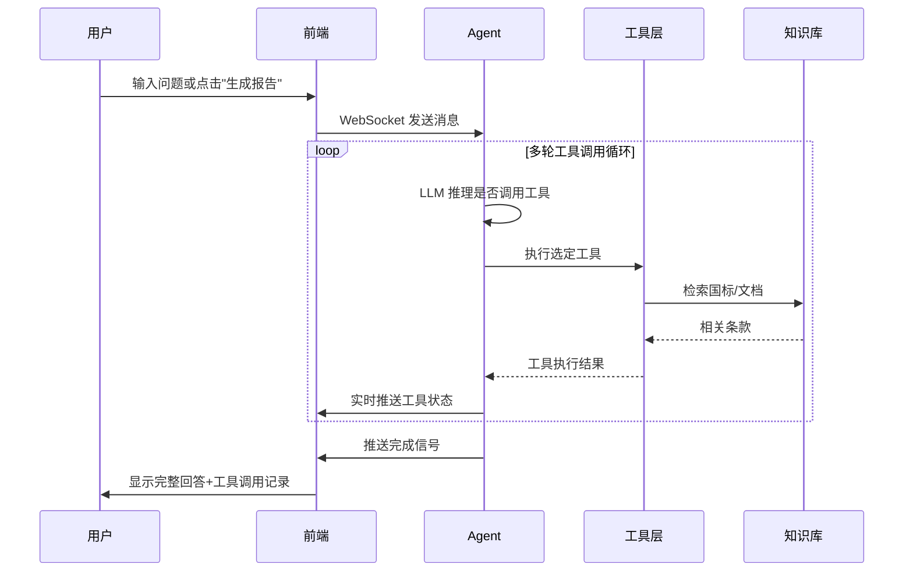

# DMS Agent — 项目文档

> DMS（驾驶员监测系统）数字工程师 AI Agent —— 基于 LangGraph + FAISS + DeepSeek 的专业评估工具

## 目录

- [功能特性](#功能特性)
- [系统工作原理](#系统工作原理)
- [快速开始](#快速开始)
- [配置说明](#配置说明)
- [使用指南](#使用指南)
- [API 参考](#api-参考)
- [项目结构](#项目结构)
- [常见问题](#常见问题)
- [技术栈](#技术栈)

---

## 功能特性

- **AI 驱动的 DMS 专业评估** — 基于 DeepSeek 大模型的数字工程师，理解 DMS 领域的专业知识和 GB/T 国标要求
- **9 个专业工具** — 覆盖源代码分析、性能日志解析、国标检索、代码修改、指标对比、报告生成
- **双轨 RAG 知识库** — 全局 GB/T 国标知识库 + 用户自定义文档知识库，自动合并搜索结果
- **流式对话** — WebSocket 实时推送 token、工具调用状态、代码 diff、报告生成通知
- **代码修改与 Diff** — 安全修改代码（片段唯一性校验 + 高风险关键词检测），并排 diff 对比
- **性能指标分析** — 自动解析 CSV 性能日志，按 DMS 标准（FPS/延迟/CPU/内存）进行判定
- **评估报告生成** — 一键生成 Markdown 评估报告，可下载
- **多会话管理** — 支持创建/切换/删除多个独立会话，localStorage 持久化
- **文件管理** — 拖拽上传、文件夹管理、ZIP 批量下载
- **中英文界面** — 前端 UI 国际化切换

---

## 系统工作原理

### 核心流程

```mermaid
graph TB
    U([用户上传 DMS 源文件]) --> UP[文件存储到 uploads/]
    U --> MSG[发送对话消息]
    MSG --> AG[DMS Agent 分析请求]
    AG --> TOOLS{需要工具?}
    TOOLS -->|是| TL[调用专业工具]
    TL --> KB[检索国标/文档知识库]
    TL --> LOG[解析性能日志]
    TL --> CODE[分析/修改源代码]
    TL --> RESULT[工具返回结果]
    RESULT --> AG
    TOOLS -->|否| REPLY[生成专业回复]
    REPLY --> STREAM[WebSocket 流式推送]
    STREAM --> UI[前端渲染消息+工具卡片]

    style AG fill:#e3f2fd
    style TL fill:#fff3e0
    style REPLY fill:#e1f5e1
    style UI fill:#fce4ec
```



### Agent 工作循环



---

## 快速开始

### 前置条件

- Python 3.10+
- pip（Python 包管理器）
- Git（可选，用于克隆仓库）

### 1. 克隆项目

```bash
git clone <repository-url>
cd DMS_Agent_Project
```

### 2. 安装依赖

```bash
pip install -r requirements.txt
```

> 依赖包括：langchain、langchain-openai、fastapi、uvicorn、pandas、faiss-cpu、sentence-transformers、pypdf 等 14 个包。

### 3. 配置 API 密钥

编辑项目根目录的 `.env` 文件：

```bash
# 必填项
DEEPSEEK_API_KEY=sk-your-api-key-here

# 可选项（以下为默认值）
# DEEPSEEK_API_BASE=https://api.deepseek.com
# DMS_LLM_MODEL=deepseek-v4-pro
# DMS_PORT=8000
# HF_ENDPOINT=https://hf-mirror.com   # 国内推荐使用镜像
```

> 获取 DeepSeek API Key：访问 [platform.deepseek.com](https://platform.deepseek.com) 注册并创建 API Key。

### 4. 启动服务

```bash
python server.py
```

**预期输出**：
```
[2026-01-01 12:00:00] INFO dms: DMS Agent server starting on http://127.0.0.1:8002
[2026-01-01 12:00:00] INFO dms: Loading embedding model...
[2026-01-01 12:00:15] INFO dms: Global knowledge base ready (XX chunks)
```

### 5. 打开前端

浏览器访问 **http://127.0.0.1:8002**（端口以 `.env` 中 `DMS_PORT` 配置为准）。

首次加载后等待 "Agent Ready" 状态提示（左上角指示灯变绿），即可开始对话。

### 6. 验证运行

1. 在输入框输入 `你好，请问你能帮我做什么？`
2. Agent 应返回 DMS 专业评估能力的介绍
3. 观察右侧面板 "Sessions" 显示当前会话

> **注意**：首次启动约需 10-15 秒，sentence-transformers 嵌入模型需要加载。

---

## 配置说明

### 环境变量完整参考

#### DeepSeek API 配置

| 变量 | 必填 | 默认值 | 说明 |
|------|:--:|--------|------|
| `DEEPSEEK_API_KEY` | ✅ | — | DeepSeek API 密钥，从 platform.deepseek.com 获取 |
| `DEEPSEEK_API_BASE` | | `https://api.deepseek.com` | API 基础地址 |

#### LLM 参数

| 变量 | 必填 | 默认值 | 说明 |
|------|:--:|--------|------|
| `DMS_LLM_MODEL` | | `DeepSeek-R1` | 使用的模型名称。可选：`deepseek-v4-pro`、`deepseek-chat` 等 |
| `DMS_TEMPERATURE` | | `0.2` | 输出温度 (0-1)。值越低输出越稳定，推荐 DMS 评估场景使用 0.1-0.3 |
| `DMS_TOP_P` | | `0.8` | 核采样参数 (0-1) |
| `DMS_MAX_TOKENS` | | `4096` | 单次回复最大输出 token 数 |

#### 嵌入模型配置

| 变量 | 必填 | 默认值 | 说明 |
|------|:--:|--------|------|
| `DMS_EMBEDDING_MODEL` | | `sentence-transformers/paraphrase-multilingual-MiniLM-L12-v2` | 文本嵌入模型 |
| `HF_TOKEN` | | — | HuggingFace API Token（用于下载模型） |
| `HF_ENDPOINT` | | — | HuggingFace 镜像地址。国内推荐 `https://hf-mirror.com` |
| `HF_HUB_OFFLINE` | | `0` | 设为 `1` 使用离线模式（模型已缓存时） |

#### 服务配置

| 变量 | 必填 | 默认值 | 说明 |
|------|:--:|--------|------|
| `DMS_PORT` | | `8000` | HTTP 服务监听端口 |

### 配置优先级

系统环境变量 > `.env` 文件 > 代码默认值

---

## 使用指南

### 基本对话

在聊天输入框输入问题，点击发送（或按 Ctrl+Enter）。Agent 会根据问题自动判断是否需要调用工具。

**简单问题（直接回答）**：
- "DMS 系统中 FPS 的合格标准是多少？"
- "GB/T 对疲劳检测有什么要求？"

**分析请求（会调用工具）**：
- "帮我分析一下上传的 process_video.py 的性能瓶颈"
- "检查我的日志文件是否符合国标延迟要求"

**全面评估（生成报告）**：
- 点击右侧面板底部 "Generate Report" 按钮
- 或输入 "请对我的系统做一次完整的性能评估"

### 上传文件

1. 点击左侧导航栏的 📁 上传按钮
2. 选择文件（支持 `.py`、`.csv`、`.pdf`、`.txt`、`.md`）
3. 或直接拖拽文件到上传区域
4. 文件显示在右侧面板 "Files" 列表中

**上传源码**：Agent 可以分析代码结构、读取实现细节、修改代码

**上传性能日志 CSV**：需包含 `timestamp`、`fps`、`latency_ms` 列（可选 `cpu_usage`、`memory_usage_mb`）

**上传知识文档**：通过右侧面板 "Knowledge Base" 区域上传 PDF/TXT/MD，内容会被索引到知识库

### 查看工具调用

Agent 回答中嵌入的工具调用组默认折叠，点击组标题可展开查看：
- **运行中**：左侧金色脉冲动画
- **成功**：绿色边框 + ✓ 标记
- **失败**：红色边框 + ✗ 标记

### 代码修改流程

1. 上传源代码文件
2. 告诉 Agent 需要修改什么（如 "把检测阈值从 0.5 改成 0.6"）
3. Agent 会先用 `read_code_file` 确认代码内容
4. 然后调用 `modify_code` 执行修改
5. 前端显示 diff 对比卡片，可下载修改后的文件

### 生成评估报告

1. 上传相关文件（源码 + 性能日志）
2. 点击右侧面板 "Generate Report" 按钮
3. Agent 自动执行完整的评估流程
4. 报告生成后自动出现在 "Reports" 折叠面板
5. 点击报告文件名可下载

### 知识库管理

1. 在右侧面板 "Knowledge Base" 区域上传 PDF/TXT/MD 文档
2. 文档内容自动索引，可通过 `search_standards` 工具检索
3. 搜索时知识库自动合并全局国标 + 用户文档
4. 删除文档时同步清理索引

### 导出对话

点击对话区右上角的导出按钮，支持：
- **Markdown** — 适合归档和分享
- **JSON** — 适合程序处理
- **TXT** — 纯文本
- **PDF** — 浏览器打印

---

## API 参考

### 基础信息

- **Base URL**: `http://127.0.0.1:{DMS_PORT}`
- **Content-Type**: `application/json`（HTTP）/ JSON 文本（WebSocket）
- **文件上传**: `multipart/form-data`

### 会话管理

#### 创建会话
```
POST /api/session
Content-Type: application/json

{
  "local_session_id": "optional-persistent-id",
  "expected_files": ["file1.py", "file2.csv"]
}

Response 200:
{
  "session_id": "a1b2c3d4e5f6"
}
```

#### 查询会话状态
```
GET /api/session/{session_id}/status

Response 200:
{
  "agent_ready": true,
  "agent_error": null,
  "files": ["process_video.py"],
  "modified_files": [],
  "knowledge_files": ["my_standards.pdf"],
  "reports": []
}
```

#### 删除会话
```
DELETE /api/session/{session_id}

Response 200:
{
  "status": "deleted"
}
```

### 文件管理

#### 上传文件
```
POST /api/upload
Content-Type: multipart/form-data

session_id: a1b2c3d4e5f6
file: (binary)

Response 200:
{
  "filename": "process_video.py",
  "size": 12345
}
```

#### 列出文件
```
GET /api/session/{session_id}/files

Response 200:
{
  "files": ["process_video.py", "subdir/utils.py"]
}
```

#### 下载文件
```
GET /api/session/{session_id}/download/{filename}

Response 200: (binary file download)
```

#### 打包下载
```
GET /api/session/{session_id}/download-all

Response 200: (ZIP file download)
```

### 知识库

#### 上传知识文档
```
POST /api/session/{session_id}/knowledge
Content-Type: multipart/form-data

file: (binary .pdf/.txt/.md)

Response 200:
{
  "filename": "reference_standards.pdf",
  "size": 567890
}
```

#### 列出知识文档
```
GET /api/session/{session_id}/knowledge

Response 200:
{
  "knowledge_files": ["reference_standards.pdf"]
}
```

#### 删除知识文档
```
DELETE /api/session/{session_id}/knowledge/{filename}

Response 200:
{
  "status": "deleted",
  "filename": "reference_standards.pdf"
}
```

### 报告与导出

#### 列出报告
```
GET /api/session/{session_id}/reports

Response 200:
{
  "reports": [
    {
      "filename": "dms_report_20260101_120000.md",
      "timestamp": "2026-01-01T12:00:00",
      "download_url": "/api/session/a1b2c3d4e5f6/download/dms_report_20260101_120000.md"
    }
  ]
}
```

#### 导出对话
```
GET /api/session/{session_id}/export?format=md

Response 200: (markdown file download)
```

### WebSocket 实时对话

```
WS /ws/{session_id}

发送消息:
{"type": "chat", "content": "用户消息", "history": [...]}
{"type": "cancel"}

接收消息:
{"type": "status", "subtype": "agent_ready"}
{"type": "status", "subtype": "started"}
{"type": "token", "content": "文本片段"}
{"type": "tool_start", "id": "...", "tool_name": "...", "args": "..."}
{"type": "tool_end", "id": "...", "tool_name": "...", "result": "...", "is_error": false}
{"type": "diff_card", "filename": "...", "diff_text": "...", "download_url": "..."}
{"type": "action_result", "action": "report_generated", "filename": "...", "download_url": "..."}
{"type": "content_replace", "content": "清洗后的完整文本"}
{"type": "done"}
{"type": "error", "message": "错误信息"}
```

---

## 项目结构

```
DMS_Agent_Project/
│
├── server.py                    # FastAPI 服务入口
│   ├── Session / SessionManager # 会话数据模型与生命周期管理
│   ├── HTTP endpoints           # 19 个 REST API 端点
│   ├── WebSocket handler        # 流式对话主通道
│   └── Static file serving      # 前端页面分发
│
├── src/
│   ├── agent_core.py            # DMSAgent 核心
│   │   ├── DMS_SYSTEM_PROMPT   # 77 行中文 System Prompt
│   │   ├── DMSAgentState       # TypedDict 状态定义
│   │   ├── DMSAgent            # LangGraph 状态图 + 9 工具
│   │   ├── _parse_xml_to_tool_calls()  # DeepSeek XML 解析
│   │   └── _strip_xml()        # XML 文本清洗
│   │
│   ├── tools.py                 # 9 个 LangChain Tool
│   │   ├── 探索类: scan_codebase / analyze_code_structure / read_code_file
│   │   │         parse_performance_logs / search_standards / search_web
│   │   └── 行动类: modify_code / compare_metrics / save_report
│   │
│   ├── config.py                # 配置加载（.env → Final 常量）
│   ├── code_analyzer.py         # AST 代码分析 + 目录扫描 + 文件读取
│   ├── rag_engine.py            # 全局知识库（GB/T 国标 FAISS）
│   ├── session_kb.py            # 会话知识库（用户文档 FAISS）
│   ├── models.py                # 数据模型（LogItem 等）
│   └── parsers.py               # CSV 日志解析器
│
├── static/
│   └── index.html               # 单文件前端 SPA (~3500 行)
│       ├── CSS (inlined)        # 深色主题 + 金色点缀
│       ├── HTML 三栏布局         # 导航栏 | 对话区 | 右侧面板
│       └── JS (inlined)         # WebSocket 客户端 + 渲染器 + 会话管理
│
├── data/
│   ├── standards/               # GB/T 国标准知识源
│   │   ├── 疲劳驾驶检测国标.pdf
│   │   └── faiss_index/         # 预计算向量索引
│   └── source_code/             # 示例 DMS 源码（人脸检测等）
│
├── reports/                     # Agent 生成的评估报告
├── uploads/                     # 用户上传文件（按会话ID分目录）
├── requirements.txt             # Python 依赖清单
├── .env                         # 环境变量配置（不纳入版本控制）
└── .gitignore
```

---

## 常见问题

### 启动相关

**Q: 启动时卡在 "Loading embedding model..."？**
A: 首次启动需要从 HuggingFace 下载约 118MB 的嵌入模型。建议在 `.env` 中设置 `HF_ENDPOINT=https://hf-mirror.com` 使用国内镜像加速。

**Q: 端口被占用怎么办？**
A: 修改 `.env` 中的 `DMS_PORT` 为其他端口，或在终端执行以下命令释放端口：
```bash
netstat -ano | findstr ":8000.*LISTENING"
taskkill /PID <显示的PID>
```

**Q: 为什么启动后要等 10-15 秒才能用？**
A: Agent 首次创建会话时需要加载 sentence-transformers 嵌入模型和 FAISS 索引。后续会话创建较快（复用已加载的单例）。

### 使用相关

**Q: Agent 不调用工具直接回答？**
A: 对于纯知识性问答（如"DMS 的 FPS 合格标准是什么"），Agent 已内嵌领域知识，不需要额外调用工具。涉及用户文件/数据的分析才会调用工具。

**Q: Agent 重复调用同一个工具？**
A: 系统内置防重复机制。如果 Agent 尝试用相同参数重复调用同一工具，会被强制切换到文本回复模式。

**Q: 修改代码后能撤销吗？**
A: 系统没有内置撤销功能。建议修改前备份文件，或上传副本到新会话进行测试。

**Q: DuckDuckGo 搜索失败？**
A: 部分校园网环境限制了 DuckDuckGo 访问。这不影响其他功能，Agent 会提示搜索失败并继续分析。

**Q: 上传大文件会怎样？**
A: FastAPI 默认无文件大小限制，但建议单个文件控制在 50MB 以内，避免影响 WebSocket 流式传输的稳定性。

### 配置相关

**Q: 如何更换 LLM 模型？**
A: 修改 `.env` 中的 `DMS_LLM_MODEL`。支持的模型取决于 DeepSeek 平台当前可用的模型列表。

**Q: 嵌入模型可以换吗？**
A: 可以。修改 `DMS_EMBEDDING_MODEL` 为其他 sentence-transformers 兼容模型。注意不同模型的向量维度不同，更换后需要删除 `data/standards/faiss_index/` 下的旧索引让其重建。

---

## 技术栈

| 类别 | 技术 | 版本要求 |
|------|------|---------|
| **AI 框架** | LangChain + LangGraph | latest |
| **LLM** | DeepSeek (via ChatOpenAI) | - |
| **嵌入模型** | sentence-transformers paraphrase-multilingual-MiniLM-L12-v2 | - |
| **向量库** | FAISS (faiss-cpu) | latest |
| **后端** | FastAPI + uvicorn | latest |
| **实时通信** | WebSocket (asyncio) | - |
| **数据处理** | pandas | latest |
| **PDF 解析** | pypdf | latest |
| **网页搜索** | ddgs / duckduckgo_search | latest |
| **前端** | 原生 HTML/CSS/JS | — |
| **Python** | 3.10+ | — |

---

## 相关文档

- [DMS_Agent_项目详解.md](./DMS_Agent_项目详解.md) — 项目架构与实现细节深度解析（中文）
- [DEMO_SCRIPT.md](./DEMO_SCRIPT.md) — 演示视频录制脚本
