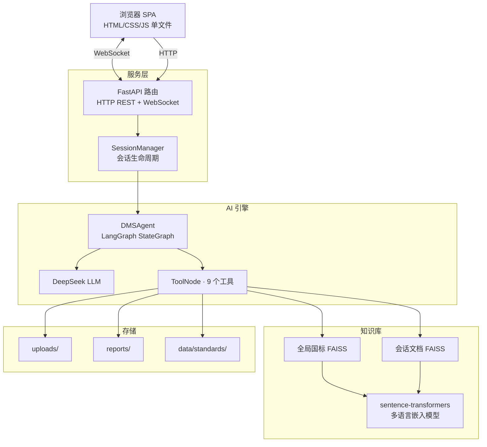
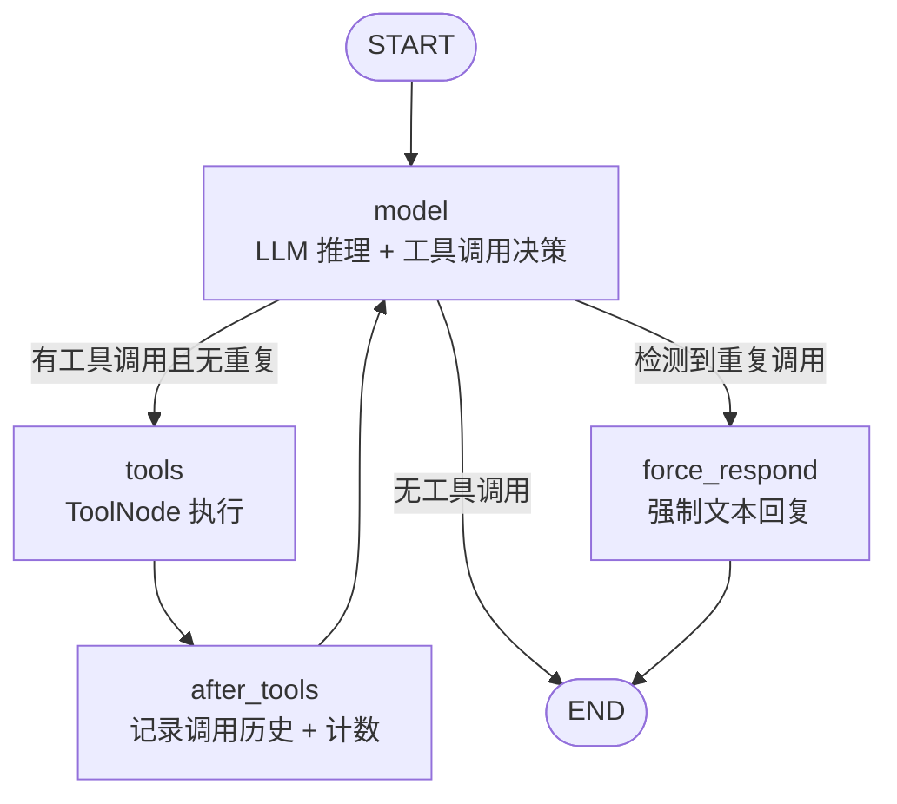
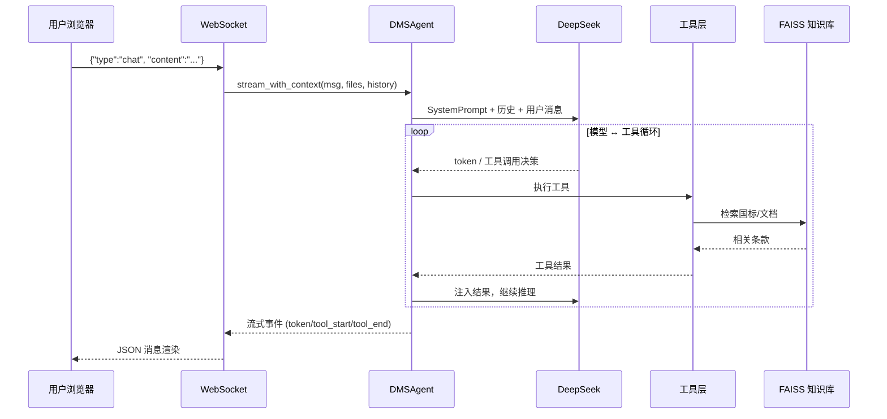

# DMS Agent — 驾驶员监测系统 AI 评估助手

基于 **LangGraph StateGraph + DeepSeek LLM + FAISS 向量知识库** 构建的 DMS（Driver Monitoring System）智能数字工程师。支持对话式交互，可解析性能日志、分析源码结构、检索国标条款、修改代码、对比指标并生成结构化评估报告。

## 功能特性

- **AI 驱动的专业评估** — DeepSeek 大模型 + 77 行中文 System Prompt，内嵌 DMS 领域知识（指标体系、GB/T 要求、标准架构），像资深工程师一样协作
- **9 个专业工具** — 覆盖源码扫描、AST 结构分析、日志解析、国标 RAG 检索、Web 搜索、代码修改、指标对比、报告生成全流程
- **双轨 RAG 知识库** — 全局 GB/T 国标 FAISS 索引 + 用户自定义文档索引，自动合并检索结果
- **流式对话** — WebSocket 实时推送 token、工具调用状态、代码 diff 卡片、报告生成通知
- **代码修改与 Diff** — 片段唯一性校验 + 安全关键词检测，生成 unified diff 并排对比，支持一键下载
- **多会话管理** — localStorage 持久化，创建/切换/删除会话，文件与对话历史独立隔离
- **文件管理** — 拖拽上传、文件夹组织、重命名、ZIP 批量下载
- **中英文界面** — UI 国际化切换
- **三层 XML 防御** — 针对 DeepSeek XML 幻觉的专项防护（实时解析 → 流式清洗 → 终态剥离）

## 系统架构



### Agent 工作循环



**节点说明：**

| 节点              | 功能                                                     |
| --------------- | ------------------------------------------------------ |
| `model`         | 调用 LLM 决定是否调工具，同步执行 XML 幻觉检测与修复                        |
| `tools`         | LangGraph 内置 ToolNode，执行实际工具函数                         |
| `after_tools`   | 更新 `tool_call_count`、`tool_call_history`、`round_count` |
| `force_respond` | 检测到同一工具+同一参数重复调用时，剥离未执行消息，强制 LLM 给出文本回复                |

## 快速开始

### 前置条件

- Python 3.10+
- pip

### 1. 克隆并安装

```bash
git clone <repo-url>
cd DMS_Agent_Project
pip install -r requirements.txt
```

### 2. 配置 .env

在项目根目录创建 `.env`：

```env
# 必填
DEEPSEEK_API_KEY=sk-your-api-key-here

# 可选（以下为默认值）
DEEPSEEK_API_BASE=https://api.deepseek.com
DMS_LLM_MODEL=DeepSeek-R1
DMS_TEMPERATURE=0.2
DMS_TOP_P=0.8
DMS_MAX_TOKENS=4096
DMS_PORT=8000

# 国内推荐配置 HF 镜像加速嵌入模型下载
HF_ENDPOINT=https://hf-mirror.com
```

### 3. 启动

```bash
python server.py
```

浏览器访问 **http://127.0.0.1:8000**（端口以 `.env` 中 `DMS_PORT` 为准）。

首次启动约需 10-15 秒加载 sentence-transformers 嵌入模型和 FAISS 索引，左上角指示灯变绿即就绪。

## 使用指南

### 对话深度

| 问题类型 | 示例                   | Agent 行为                |
| ---- | -------------------- | ----------------------- |
| 知识问答 | "FPS 合格标准是多少？"       | 直接回答（内嵌领域知识）            |
| 分析请求 | "帮我分析上传的源码性能瓶颈"      | 调用工具获取数据后给出针对性判断        |
| 完整评估 | "做一个全面审查" / 点击"生成报告" | 系统覆盖所有维度，生成 Markdown 报告 |

### 典型工作流

1. **上传文件** — 点击左侧上传按钮或拖拽，支持 `.py` / `.csv` / `.pdf` / `.txt` / `.md`
2. **代码分析** — Agent 依次调用 `scan_codebase` → `analyze_code_structure` → `read_code_file` 精确定位
3. **日志评估** — 上传性能 CSV（需含 `timestamp`, `fps`, `latency_ms` 列），Agent 按 DMS 标准判定合格性
4. **国标检索** — 提问国标要求，`search_standards` 同时检索全局国标 + 用户上传文档
5. **代码修改** — Agent 先确认代码 → 解释原因和风险 → 调用 `modify_code` → 展示 diff 卡片
6. **指标对比** — 提供优化前后两份 CSV，`compare_metrics` 生成对比表格
7. **生成报告** — 点击右侧面板按钮，Agent 自动执行完整评估流程
8. **导出对话** — 支持 Markdown / JSON / TXT / PDF 格式

### 知识库管理

在右侧面板 "Knowledge Base" 区域上传 PDF/TXT/MD 文档，内容自动索引到会话级 FAISS 向量库。搜索时自动合并：

```
【国标 GB/T】告警延迟应不超过行为持续时间的 50%...
【用户文档 · my_standards.pdf · 条款 2】本项目要求延迟 < 200ms...
```

## Agent 工具

| 工具                       | 类型  | 说明                                     |
| ------------------------ | --- | -------------------------------------- |
| `scan_codebase`          | 探索  | 扫描目录，列出所有 `.py` 文件与大小                  |
| `analyze_code_structure` | 探索  | AST 解析，提取类/函数/导入/常量骨架                  |
| `read_code_file`         | 探索  | 读取指定文件内容（支持行范围）                        |
| `parse_performance_logs` | 探索  | 解析日志 CSV，输出 FPS/延迟/CPU/内存统计并按 DMS 标准判定 |
| `search_standards`       | 探索  | 双轨检索：全局 GB/T 国标 + 用户知识文档               |
| `search_web`             | 探索  | DuckDuckGo 搜索 DMS 技术资料                 |
| `modify_code`            | 行动  | 替换代码片段（唯一性校验 + 安全关键词检测），生成 diff        |
| `compare_metrics`        | 行动  | 对比优化前后两份日志的四项核心指标变化                    |
| `save_report`            | 行动  | 保存 Markdown 评估报告到 `reports/`           |

### DMS 判定标准

| 指标    | 优秀  | 合格           | 不合格    |
| ----- | --- | ------------ | ------ |
| FPS   | ≥30 | ≥15          | <15    |
| 端到端延迟 | —   | ≤200ms       | >500ms |
| 告警延迟  | —   | ≤行为持续时间的 50% | —      |
| 告警方式  | —   | ≥2 种（视觉+听觉）  | 仅 1 种  |

## API 参考

### REST 端点

| 方法       | 路径                                      | 说明                                     |
| -------- | --------------------------------------- | -------------------------------------- |
| `POST`   | `/api/session`                          | 创建会话，返回 `session_id`                   |
| `GET`    | `/api/session/{id}/status`              | 查询 Agent 初始化状态 + 文件/报告列表               |
| `DELETE` | `/api/session/{id}`                     | 删除会话并清理文件                              |
| `POST`   | `/api/upload`                           | 上传文件（multipart: `session_id` + `file`） |
| `GET`    | `/api/session/{id}/files`               | 列出已上传文件                                |
| `GET`    | `/api/session/{id}/modified-files`      | 列出已修改文件                                |
| `GET`    | `/api/session/{id}/download/{filename}` | 下载指定文件                                 |
| `GET`    | `/api/session/{id}/download-all`        | ZIP 打包下载全部文件                           |
| `POST`   | `/api/session/{id}/knowledge`           | 上传知识文档（PDF/TXT/MD）                     |
| `GET`    | `/api/session/{id}/knowledge`           | 列出知识文档                                 |
| `DELETE` | `/api/session/{id}/knowledge/{name}`    | 删除知识文档                                 |
| `GET`    | `/api/session/{id}/reports`             | 列出评估报告                                 |
| `GET`    | `/api/session/{id}/export?format=md`    | 导出对话（md / json / txt）                  |

### WebSocket 消息协议

**路径：** `/ws/{session_id}`

**Client → Server：**

```json
{"type": "chat", "content": "用户消息", "history": [...]}
{"type": "cancel"}
```

**Server → Client：**

| 类型                | 说明                                   |
| ----------------- | ------------------------------------ |
| `status`          | `agent_ready` / `started`            |
| `token`           | 流式文本块                                |
| `tool_start`      | 工具调用开始（含 `tool_name` + `args`）       |
| `tool_end`        | 工具调用结束（含 `result` + `is_error`）      |
| `diff_card`       | 代码修改结果（`diff_text` + `download_url`） |
| `action_result`   | 报告生成等操作完成通知                          |
| `content_replace` | XML 清洗后替换完整响应文本                      |
| `done`            | 本轮对话完成                               |
| `error`           | 错误消息                                 |

## 配置参考

### 环境变量

| 变量                    | 必填  | 默认值                                     | 说明                                  |
| --------------------- |:---:| --------------------------------------- | ----------------------------------- |
| `DEEPSEEK_API_KEY`    | ✅   | —                                       | DeepSeek API 密钥                     |
| `DEEPSEEK_API_BASE`   |     | `https://api.deepseek.com`              | API 基础地址                            |
| `DMS_LLM_MODEL`       |     | `DeepSeek-R1`                           | 模型名称                                |
| `DMS_TEMPERATURE`     |     | `0.2`                                   | 生成温度 (0-1)                          |
| `DMS_TOP_P`           |     | `0.8`                                   | 核采样参数                               |
| `DMS_MAX_TOKENS`      |     | `4096`                                  | 最大输出 token                          |
| `DMS_PORT`            |     | `8000`                                  | 服务监听端口                              |
| `DMS_EMBEDDING_MODEL` |     | `paraphrase-multilingual-MiniLM-L12-v2` | 嵌入模型                                |
| `HF_TOKEN`            |     | —                                       | HuggingFace API Token               |
| `HF_ENDPOINT`         |     | —                                       | HF 镜像（国内推荐 `https://hf-mirror.com`） |
| `HF_HUB_OFFLINE`      |     | `0`                                     | 设为 `1` 启用离线模式                       |

配置优先级：系统环境变量 > `.env` 文件 > 代码默认值。

## 项目结构

```
DMS_Agent_Project/
├── server.py                  # FastAPI 服务入口（REST + WebSocket + 会话管理）
├── requirements.txt           # Python 依赖
├── static/
│   └── index.html             # 单文件前端 SPA（三栏布局，零外部依赖）
├── src/
│   ├── agent_core.py          # DMSAgent：LangGraph StateGraph + System Prompt
│   ├── tools.py               # 9 个 LangChain 工具
│   ├── code_analyzer.py       # AST 代码结构分析 + 目录扫描 + 文件读取
│   ├── rag_engine.py          # 全局知识库（GB/T 国标 PDF → FAISS）
│   ├── session_kb.py          # 会话级知识库（用户文档 FAISS）
│   ├── xml_defense.py         # DeepSeek XML 幻觉防御（解析/清洗）
│   ├── config.py              # 配置加载（.env → Final 常量） + 日志工具
│   ├── models.py              # Pydantic 数据模型
│   └── parsers.py             # CSV 日志解析器
├── data/
│   ├── standards/             # 国标 PDF + FAISS 索引
│   └── source_code/           # 示例 DMS 源码
├── reports/                   # Agent 生成的评估报告
├── uploads/                   # 用户上传文件（按会话 ID 隔离）
└── .env                       # 环境配置（不入库）
```

## 数据流



## 常见问题

**Q: 启动后页面长时间显示 "Agent initializing"？**
A: 首次启动需从 HuggingFace 下载约 118MB 的嵌入模型。配置 `HF_ENDPOINT=https://hf-mirror.com` 可加速。后续启动复用缓存，约 2-3 秒。

**Q: RAG 检索无结果？**
A: 确认 `data/standards/` 下有国标 PDF 文件，首次启动会自动构建 FAISS 索引。检查控制台日志是否有 "FAISS index saved" 提示。

**Q: DuckDuckGo 搜索失败？**
A: 部分校园网环境限制 DuckDuckGo，不影响其他功能。Agent 会提示搜索失败并继续分析。

**Q: 修改代码后能撤销吗？**
A: 系统不内置撤销。建议在 Git 管理下使用，修改前先 commit。

**Q: 端口被占用？**

```bash
# 查看占用进程
netstat -ano | findstr ":8000.*LISTENING"
# 终止进程
taskkill /PID <PID>
```

或修改 `.env` 中的 `DMS_PORT` 换用其他端口。

**Q: 嵌入模型可以更换吗？**
A: 可以，修改 `DMS_EMBEDDING_MODEL` 为其他 sentence-transformers 兼容模型。更换后需删除 `data/standards/faiss_index/` 让索引重建。

## 技术栈

| 类别     | 技术                                                          |
| ------ | ----------------------------------------------------------- |
| AI 编排  | LangGraph (StateGraph)                                      |
| LLM    | DeepSeek (via ChatOpenAI)                                   |
| 嵌入模型   | sentence-transformers paraphrase-multilingual-MiniLM-L12-v2 |
| 向量库    | FAISS (faiss-cpu)                                           |
| 后端     | FastAPI + uvicorn + WebSocket                               |
| 前端     | 原生 HTML/CSS/JS（单文件 SPA）                                     |
| 数据处理   | pandas                                                      |
| PDF 解析 | pypdf                                                       |
| 代码分析   | Python AST                                                  |
| Web 搜索 | ddgs (DuckDuckGo)                                           |

## 相关文档

- [DMS_Agent_项目详解.md](./DMS_Agent_项目详解.md) — 项目架构与实现细节深度解析
- [PROJECT_DOCUMENTATION.md](./PROJECT_DOCUMENTATION.md) — 完整项目文档（英文风格）
